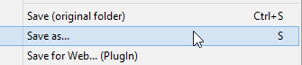
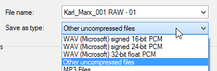

<link rel="stylesheet" type="text/css" href="style.css">

## hwo 2 databend
### A guide to breaking pictures for fun and profit

## You will need
- [Irfanview](https://www.irfanview.com/) (Super-compatible image viewer)
- [Audacity](https://www.audacityteam.org/) (Audio editing software)

## Instructions:

Find some picture online. Here's mine. Open it in Irfanview:

Click **File** then **Save As**

Set the type to **RAW**

Set the save options to **Planar**

Take note of the original size of the picture. To do this, click **Image** then **Information**

You can technically start right here. First, let's view our RAW as intended. Open the RAW file in irfan view. You'll get the **open parameters** prompt.

You'll probably want to leave it at **24bpp** for now. Color Order is probably correct as well, and we want **Planar**. 

Importantly, we want to set the Image **Height** and **Width** to what we noted earlier

And the anticlimatic end, we have good ol' Marx

So what happens if we were to enter the **width** wrong, just 1 pixel off?

What about a bad height ? Let's do 100 off for **height**

What happens if we set it to **12BPP**?

Once you have something you like, **Save As** again, this time save as **PNG**

Ok cool, so that's what we can do with Irfanview alone. How about we mix it up a bit.

Launch Audacity. Click **File**, then **Import** > **Raw Data**

Select the RAW file. This is where filenames help

Next it'll prompt for the encoding settings. After experimenting, I've found that importing **Unsigned 8-bit PCM** and **Little-Endian** adds the least artifacts in the reading. Of course, the point is to break pictures in interesting ways, so experiment!

Congratulations, you have a waveform! Notice how it looks like the pattern repeats three times? Those are your color planes. If you can figure out whereabout the seams are, you can mess with specific planes. That's why I suggest planar

Here I've selected what should be approximately the green color plane

Let's do something to it. But what? Well, how about an Echo? Click **Effect**, then **Echo**

Let's set **Delay Time** to **1** and **Decay Factor** to **0.5**

Ok cool, so we did something to the waveform! Let's export it and see the result. Click **File**, then **Export** > **Audio**

Give it a good name, then pick **Other Uncompressed Files** as a file type

In the format options, pick **RAW (Header-less)** for the header and **Unsigned 8-bit PCM** for the encoding

On the metadata window, check **Don't Show This When Exporting Audio** and then Ok. Don't fill anything in

Let's see the result. Don't forget to put it back to **24bpp** if you messed with it earlier.

A spectre fit to haunt europe ! So, remember when I went on about **Unsigned 8-bit PCM**? What if we took the waveform we just exported, that we imported as **Unsigned 8-bit PCM**, and exported it as something else. Let's try **U-law**

Ok, cool, not really that big a change though. Let's try something else. Maybe **32-bit Float**?

Hmm. 

Voila ! That's really all of it. Convert to RAW, import into audacity with some set of encoding settings, apply filters to selections and otherwise mess with the waveform, export with some set of encoding settings (maybe not the same), then open in irfanview with some set of open parameters (not necessarily the correct ones) and you too can make cool glitchy pictures. One quick way to get overlapping ghost images is to change the balance to either L or R. Another is to import stereo then only do things to one channel. Play around, experiment, iterate.

## Intructions part 2 electric bugaloo : or, why you shouldn't listen to my dumb ass

Try interleaved. Pitch does a prismatic horizontal bleed. Speed skews the image. Tempo does too, but in this great glitchy chunk way. Use SMALL values. 0.25% change type small. SMALL. Tiny. 

I might expand on this, but for now just trust me. Planar makes cool prismatic shit really easily. Interleaved looks like the kind of glitch VCRs have. 

